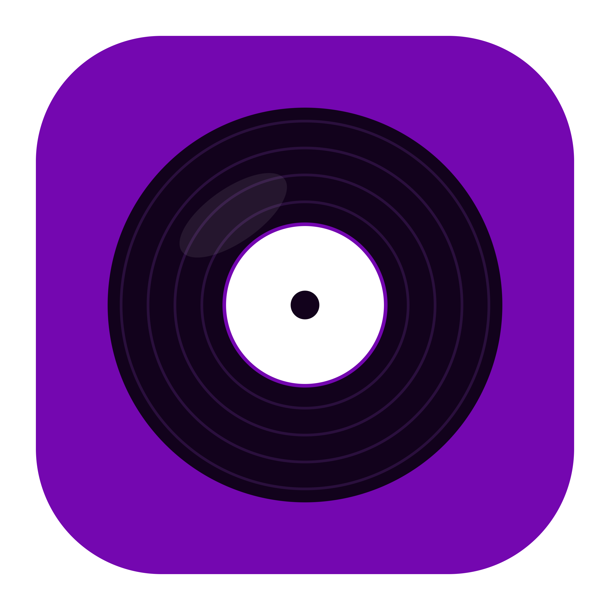

<h1 align="center">Music Hub</h1>

**Please note:** This repo and all of its content have been created 100% by AI (Claude Opus 5/5.5). 

**Music Hub** is my personal music dashboard built around Spotify. It brings together everything I like to do with music in one place: finding upcoming concerts of the artists I follow, exploring how these artists are connected, turning setlists into playlists, keeping a gallery of the concerts I went to and checking for new vinyl releases.

Besides Spotify, it uses the Ticketmaster, Last.fm, setlist.fm, Discogs, Google Calendar and Google Drive APIs.

There is no database, so everything the app saves is stored in your browser. On the live app this data is also synced between all your browsers via your own Google Drive.

## Current Features

### Pages

- **Concerts:** Fetches the upcoming concerts of all artists you follow on Spotify in a set list of German cities.
  - Duplicate events (e.g. VIP tickets or co-headline tours) are merged into one item.
  - Concerts that weren't there during the last fetch are highlighted as new.
  - Every concert can be added to your Google Calendar with one click or simply be marked as attended.
- **Artist Graph:** Shows all artists you follow on Spotify as a graph, where similar artists (based on Last.fm data) are connected to each other.
  - Can be updated with newly followed artists without re-fetching everything.
  - Recommended artists you don't follow yet can be toggled on, and the ones you like can be followed right from the graph.
  - A small badge shows how many concerts of that artist are in your Gallery.
  - Click on an artist to open them in the Spotify app.
- **Setlists:** Searches setlist.fm for the latest setlist of an artist in a city and adds the songs to one of your Spotify playlists.
  - Songs are matched with Spotify tracks automatically, the ones that couldn't be matched can be picked by hand or skipped.
  - Past concerts you marked as attended on the Concerts page are listed as shortcuts.
- **Gallery:** A gallery of the concerts you went to, sorted into artist and concert folders, with your images and videos from Google Drive.
  - Fills itself from a "Concerts" folder in your Google Drive (or any other folder set in Settings).
  - Images and videos can also be added by pasting Google Drive links.
- **Discogs:** Checks Discogs for new vinyl releases of all artists you follow on Spotify.
  - A "Pick of the Day" suggests a random record from your own Discogs collection on every page load.
  - Every release card slides its record out of the sleeve on hover, drawn to look like the actual pressing (colour, marble, splatter, picture disc and many more).
- **Albums:** Opens a CS:GO-style case to pick a random album out of your Spotify Saved Albums to listen to.
  - Albums get a rarity tier based on how long they have been saved, so the albums that have waited longest come up most.
  - Listened albums can be added to your album history, with your own rating.
- **Store:** Spend the coins you earn around the app on username styles, a golden record player, Mystery Vinyls or extra spins on the Wheel of Fortune.
- **Collection:** Your collection of unboxed vinyls. Press **Play** on any of them to put it on the record player and start the album on your Spotify.
  - Add the song that's currently playing to your playlists right from the record player.
  - Playlists can be set to rotate, so they only keep your newest songs.
- **Settings:** Export and import your data, manage the Google login and Drive sync, set your Gallery folder, Spotify playlists and Discogs username, and turn the sound effects on or off.
- **External tools:** The navbar also links to some other Spotify tools I like to use (including my own [Spotify Video Matcher](https://github.com/cide0/spotify-video-matcher)).

### Coins & Wheel of Fortune

- Coins are earned by opening album cases, marking albums as listened, going to concerts, adding setlists to playlists and more.
- The Wheel of Fortune in the navbar can be spun for free once a day and pays out coins, respins, Mystery Vinyls or one of forty exclusive vinyls that can't be found anywhere else.
- Animations and sound effects everywhere! :partying_face:

### Data & Sync

- All your data is stored in your browser's `localStorage`. There is no database, and no API key ever leaves the server.
- Once you log in to Google with Drive access, your data is synced between all your browsers via a hidden app folder in your Google Drive. It can be turned off in Settings.
- Your data can also be exported to a file and imported on another device.

Notes: The Google Drive sync never runs in local development, so a local setup can't touch the real data in your Drive.
Also, starting an album from the record player needs a Spotify Premium account (otherwise the album is just opened in Spotify).

## Setup

1. Create a new app in the Spotify Developer Dashboard: https://developer.spotify.com/dashboard and add a redirect URI for your app (e.g. `http://127.0.0.1:8080/callback` for local use).

2. Create a new project in the Google Cloud Console: https://console.cloud.google.com/
   - Enable the Google Calendar API and the Google Drive API for your project
   - Create an OAuth client ID (web application) and add a redirect URI for it (e.g. `http://127.0.0.1:8080/auth/google/callback` for local use)
   - Add the `calendar.events`, `drive.appdata` and `drive.metadata.readonly` scopes to your OAuth consent screen

3. Get API keys for the other services:
   - Ticketmaster: https://developer.ticketmaster.com/
   - setlist.fm: https://www.setlist.fm/settings/api
   - Last.fm: https://www.last.fm/api/account/create
   - Discogs: Create a personal access token at https://www.discogs.com/settings/developers

4. Copy `.env.example` to `.env` and fill in your actual credentials (`make install` creates the `.env` for you if it doesn't exist yet):
   - `SPOTIFY_CLIENT_ID` - Your Spotify application client ID
   - `SPOTIFY_CLIENT_SECRET` - Your Spotify application client secret
   - `SPOTIFY_REDIRECT_URI` - The redirect URI from your Spotify app settings
   - `SESSION_SECRET` - A random secret used to sign the logins, run `make generate-secret` to create one
   - `TICKETMASTER_API_KEY` - Your Ticketmaster API key
   - `GOOGLE_CLIENT_ID` - Your Google OAuth client ID
   - `GOOGLE_CLIENT_SECRET` - Your Google OAuth client secret
   - `GOOGLE_REDIRECT_URI` - The redirect URI from your Google OAuth client settings
   - `SETLISTFM_API_KEY` - Your setlist.fm API key
   - `LASTFM_API_KEY` - Your Last.fm API key
   - `DISCOGS_TOKEN` - Your Discogs personal access token
   - `PORT` - Server port (default: 8080)

5. Run these make targets in order:
   - `make install`
   - `make up`

6. Open your browser and go to [Localhost on port 8080](http://127.0.0.1:8080) (or the port you specified in `.env`).

7. Log in to Spotify and fetch your followed artists with the refresh button in the navbar. To use the Discogs page, save your Discogs username in Settings (your collection has to be public).

## Make Targets

There are different make targets available to install and run this project:
- `make list` - List all available make targets.
- `make build-dev` - Build the Docker image.
- `make npm-install` - Install `npm` dependencies (inside the container).
- `make install` - Run `make build-dev` and `make npm-install`.
- `make up` - Start the container.
- `make down` - Stop the container.
- `make cleanup` - Cleanup all containers, images and volumes.
- `make generate-secret` - Print a random value to use as `SESSION_SECRET`.
